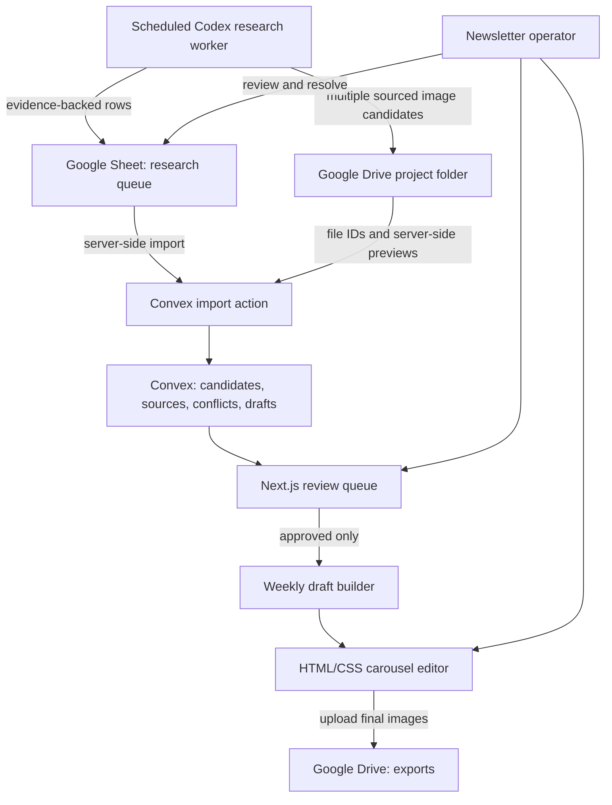
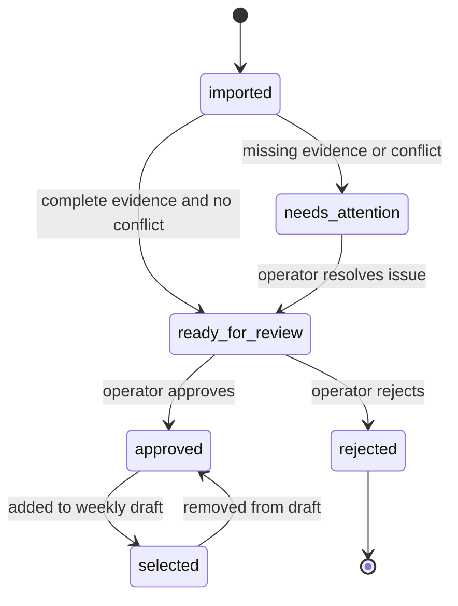

# feat: Build the evidence-first Coimbra events carousel workflow

## Goal Capsule

- **Objective:** A solo local newsletter operator can turn a reviewed weekly set of engineering-related events into an attractive, accurate Instagram carousel on Friday.
- **Means:** Use Google Sheets as the research and editorial intake, Convex as the canonical reviewed-data and draft store, Clerk-protected Next.js access, and an HTML/CSS editor with client-side image export. (KTD1, KTD2, KTD3, KTD6)
- **Authority:** The Product Contract and its evidence rules override visual automation, ranking convenience, and generated suggestions.
- **Execution profile:** Build and prove the vertical slice in dependency order. Do not add autonomous discovery or publishing before the review, provenance, and export path works.
- **Stop conditions:** Stop a carousel build when an included event has no source evidence, an unresolved material conflict, or no explicit editorial approval.
- **Tail ownership:** The operator owns source review, conflict resolution, event approval, image selection, final copy, and publishing.

---

## Product Contract

### Summary

Build a private weekly carousel tool for Coimbra and nearby northern/central Portugal.
It imports evidence-backed research rows from a Google Sheet, lets the operator review and approve them, then creates a 10-slide editorial carousel: cover, up to nine in-person events, and one final online-events slide.

### Problem Frame

The operator currently searches university messages, event pages, online murals, Instagram accounts, and news sites by hand.
They must then deduplicate events, choose what matters locally, find visuals, write legible slide copy, and reconstruct the result in Canva.
This is slow and creates an unacceptable risk of publishing a fabricated or stale date, venue, image attribution, or event detail.

### Requirements

**Evidence and editorial intake**

- R1. The system must accept event candidates only with one or more source URLs, a source label, a captured excerpt or fact note, and the time the source was collected.
- R2. The system must preserve all merged source records for a deduplicated event and identify official sources when known.
- R3. The system must flag conflicting material facts, including date, time, venue, city, title, and event status, without silently choosing a value.
- R4. The system must exclude a candidate with unresolved conflicts, missing source evidence, or a non-approved editorial status from carousel selection.
- R5. The research-worker contract must prohibit invented events, dates, venues, descriptions, source links, and image provenance.

**Weekly selection**

- R6. The operator must select a target calendar week, normally the Monday-Sunday week following that Friday's post.
- R7. The system must rank in-person candidates in this order: topic relevance, target-week match, then proximity to Coimbra.
- R8. The system must show sparse local weeks and widen suggested geography in visible stages: Coimbra area, northern Portugal, then central Portugal including Aveiro.
- R9. The system must keep online events separate from geographic fallback candidates and include up to five approved online events only on the final slide.

**Carousel and review**

- R10. The carousel must contain a cover, zero to nine approved in-person event slides, and an optional final online-events slide, never exceeding ten slides.
- R11. Each event slide must show the necessary event information in a readable template and allow the operator to edit the displayed copy, order, and chosen image before export.
- R12. Each event must offer multiple image candidates in this priority order: official event visuals, event announcement or poster visuals, then clearly labelled generated fallbacks when available.
- R13. The system must record image provenance for every candidate and never present a generated image as an official event image.
- R14. The operator must be able to export the reviewed carousel as Instagram-ready image files without automatic publishing.
- R15. The Google Sheet, captured source images, selected images, carousel exports, and run logs must be stored under one named Google Drive project folder; the app must store Drive references and metadata rather than persistent local media files.

### Success Criteria

- A Friday session can produce a coherent weekly carousel from approved, traceable events without rebuilding every slide in Canva.
- A reviewer can open any selected event and see its sources, conflict state, ranking inputs, and chosen image provenance before export.
- A sparse week remains honest: it produces fewer local slides and visible wider-area suggestions rather than filler or false locality.

### Actors

- A1. **Research worker:** A scheduled Codex task or manually run skill that adds evidence-backed candidate rows to Google Sheets.
- A2. **Operator:** The single newsletter editor who resolves conflicts, approves events, selects images, edits copy, and exports the carousel.
- A3. **Carousel app:** The private Next.js and Convex application that imports approved material, manages drafts, and exports slides.

### Key Flows

- F1. **Daily research intake**
  - **Trigger:** The research worker runs.
  - **Actors:** A1.
  - **Outcome:** The Sheet receives new or updated candidate rows with source evidence, ranking inputs, image candidates, and an explicit review state.
- F2. **Friday editorial review**
  - **Trigger:** A2 selects the next calendar week.
  - **Actors:** A2, A3.
  - **Outcome:** A2 resolves conflicts and selects only approved candidates for a weekly draft.
- F3. **Carousel export**
  - **Trigger:** A2 opens a weekly draft.
  - **Actors:** A2, A3.
  - **Outcome:** A2 adjusts content or imagery, previews the slide sequence, and downloads the completed images.

### Acceptance Examples

- AE1. **Conflicting date:** Given two sources for the same event give different dates, when the operator imports the row, then the event is marked as needing attention and cannot enter the carousel until the operator resolves it.
- AE2. **Sparse local week:** Given fewer than nine approved Coimbra-area events, when the operator prepares the week, then the app shows the local count and separately offers ranked northern and central-area candidates.
- AE3. **Online event:** Given approved online events, when the carousel is built, then they appear only in one final slide with no more than five entries.
- AE4. **Missing official artwork:** Given an event with no official visual but an announcement poster, when the operator opens the event, then the poster is the first image option and generated art is visibly secondary.

### Key Decisions

- **K1. Evidence before automation** (session-settled: user-directed — chosen over autonomous content completion: fake events and hallucinated dates are unacceptable). Governs R1, R2, R3, R4, R5, R13.
- **K2. Google Sheets is the editorial research queue** (session-settled: user-directed — chosen over a local CSV: it must be shared and not limited to one machine). Governs R1, R2, R5, R8, R12.
- **K3. Weekly output has a fixed editorial ceiling** (session-settled: user-directed — chosen over forcing ten local events: Instagram's ten-slide product cap keeps the format clear and prevents filler). Governs R9, R10.
- **K4. Image selection honours provenance order** (session-settled: user-directed — chosen over generated-first artwork: official and announcement visuals preserve trust). Governs R12, R13.

### Scope Boundaries

- The first slice covers engineering, robotics, cybersecurity, technology, and defence-related events relevant to Coimbra and nearby northern/central Portugal.
- The first slice is private and single-operator. It does not require public sign-up, multi-editor permissions, subscription billing, or automatic social publishing.
- The app does not scrape or search the web itself in the first slice. The scheduled research worker does that work and writes structured, cited rows to the Sheet.
- The app does not claim to fact-check a source. It exposes source evidence and blocks unresolved conflicts for human review.

#### Deferred to Follow-Up Work

- Automated source adapters, email inbox ingestion, Instagram extraction, and retry/monitoring for the external research worker.
- Brand libraries, multiple templates, multiple social platforms, analytics, CMS/newsletter publishing, and generated copy beyond source-grounded suggestions.
- Image generation integration when the operator has a configured provider and is willing to accept its cost and terms.

---

## Planning Contract

### Key Technical Decisions

- KTD1. **Separate editorial intake from app state.** Google Sheets holds research rows that are visible and editable by the operator. Convex stores normalized imports, review decisions, and carousel drafts. This prevents an external collector from writing directly into publishing-ready state. (session-settled: user-approved — chosen over app-first collection: the Sheet is the reviewable control plane.)
- KTD2. **Use a server-side Google service account for the app import.** Keep credentials only in Convex or deployment environment variables. Share the specific Sheet with the service account and request the narrow spreadsheet scope. This is appropriate for a private single-Sheet integration and avoids browser credential exposure. [Google service-account guidance](https://developers.google.com/identity/protocols/oauth2/service-account)
- KTD3. **Use Clerk with an allowlisted operator email for private access.** Clerk has an official Convex integration for Next.js, while Convex Auth is still beta and its Next.js server support is under active development. Every Convex query, mutation, and action must also enforce the allowlist. [Convex authentication overview](https://docs.convex.dev/auth/overview) [Convex and Clerk](https://docs.convex.dev/auth/clerk)
- KTD4. **Make Google Drive the canonical media archive.** Use one user-owned project folder, with `research-media`, `exports`, and `archive` subfolders. The research worker uploads eligible image candidates there and records Drive file IDs, original source URLs, and provenance. Convex stores metadata and Drive references, not a second permanent image library.
- KTD5. **Model provenance and conflicts as first-class data.** Store sources, supported field values, image candidates, and conflict state separately from editable carousel copy. A display field is not evidence by itself.
- KTD6. **Use explicit lifecycle gates.** Candidate states progress from `imported` to `needs_attention` or `ready_for_review`, then `approved` or `rejected`. Only `approved` candidates may be added to a draft. An operator edit to a factual field records a manual-review marker rather than silently replacing source truth.
- KTD7. **Render slides as HTML/CSS and export in the browser.** The first template is a responsive React component at the target Instagram dimensions. Client-side rendering exports only the operator-reviewed draft, then uploads the finished files to Drive rather than keeping them as local artefacts.
- KTD8. **Treat ranking as explainable, not predictive.** Persist the three ordered ranking inputs and show the reason/order to the operator. Do not introduce opaque AI scoring or invented relevance facts.
- KTD9. **Keep the daily discovery schedule outside Vercel in the first slice.** A Codex scheduled task or manually run Codex skill owns research execution. Vercel cron is not the dependable daily researcher: hobby cron runs at most once daily and may run anywhere in its selected UTC hour, and failed invocations are not retried. [Vercel cron documentation](https://vercel.com/docs/cron-jobs/manage-cron-jobs)

### High-Level Technical Design



The trust gate sits between the Sheet and the draft builder.
The draft builder receives only approved events whose source evidence remains intact and whose conflicts are resolved.

### Data and State Model



### Output Structure

```text
app/
  page.tsx
  workspace/
  carousel/
components/
  review/
  carousel/
  ui/
convex/
  schema.ts
  candidates.ts
  drafts.ts
  sheetImport.ts
  driveMedia.ts
lib/
  ranking/
  sheets/
  drive/
  carousel/
docs/
  operations/
  plans/
tests/
  unit/
  integration/
  e2e/
```

### Risks and Dependencies

- **Credential exposure:** Google service-account material and Clerk secrets never enter Git, the client bundle, or the Sheet. Mitigation: validate environment variables at startup, commit only `.env.example`, and use platform secret stores. [Google authentication guidance](https://developers.google.com/identity/protocols/oauth2/service-account)
- **Duplicate or shifted Sheet rows:** Google Sheets append operations add rows to the next detected table row. Mitigation: require a stable row ID and import timestamp, then upsert and log every import result. [Sheets values API](https://developers.google.com/workspace/sheets/api/reference/rest/v4/spreadsheets.values/append)
- **Unreachable event artwork:** External poster URLs may expire, block hotlinking, or require authentication. Mitigation: save the permitted candidate in the Drive project folder at collection time, preserve the original source URL, and show a visible fetch failure instead of silently substituting imagery.
- **Drive-access failure:** The app needs server-side access to the specific Drive folder without exposing credentials. Mitigation: restrict the service account to that folder, retain Drive file IDs, and show an explicit unavailable-media state if a file is moved or deleted.
- **Editorial data drift:** Re-importing a Sheet row can change source facts after a candidate was approved. Mitigation: re-evaluate conflicts and approval eligibility on every import, and block an affected draft from export until reviewed again.
- **Schema drift:** Convex schema validation should be enabled before editorial data becomes durable. Mitigation: validate imported records at the boundary and make schema validation part of deployment proof. [Convex schemas](https://docs.convex.dev/database/schemas)

### System-Wide Impact

- **Security boundary:** Clerk authenticates the operator, but Convex functions must independently enforce the configured email allowlist. The client must never be the sole authorization layer.
- **Data lifecycle:** Google Sheet rows remain the research record. Google Drive holds the canonical media and outputs. Convex imports are normalized working copies with Drive IDs and metadata. A draft snapshots selected candidate fields while retaining links to live candidates so a later import can invalidate export safely.
- **Human/automation boundary:** The Codex research worker may collect and structure information. It cannot approve events, resolve factual conflicts, select final imagery, or publish content.
- **Operational boundary:** The daily worker and Friday editor are separate processes. A missed worker run reduces availability of candidates; it must not cause the app to manufacture replacements.

### Documentation and Operational Notes

- Document the Google Sheet header contract, controlled vocabulary, source-evidence rules, and manual conflict-resolution steps in `docs/operations/research-worker.md`.
- Add `.env.example` with variable names only. Keep production values in Convex and Vercel environment settings.
- The eventual Codex scheduled task must be run daily. It should log a run ID and a count of added, updated, rejected, and conflict rows to the Sheet or a separate run-log tab.

---

## Implementation Units

### U1. Establish the private Next.js and Convex foundation

- **Goal:** Create the typed application shell, private access boundary, and deployment-safe configuration without exposing credentials.
- **Requirements:** R1, R4, R14.
- **Dependencies:** None.
- **Files:** `package.json`, `app/layout.tsx`, `app/page.tsx`, `app/workspace/page.tsx`, `components/providers/ConvexClientProvider.tsx`, `convex/schema.ts`, `convex/auth.config.ts`, `convex/authz.ts`, `.env.example`, `.gitignore`, `tests/integration/auth-boundary.test.ts`.
- **Approach:**
  1. Scaffold a TypeScript Next.js App Router application and connect the Convex client/provider.
  2. Configure Clerk with a single allowlisted operator email, then connect it to Convex and enforce the same allowlist in every public backend function.
  3. Define environment variable names for Convex, Google Sheet configuration, and private application authentication without committing values.
  4. Add the initial Convex schema with strict tables for candidates, sources, image candidates, and drafts; defer fields owned by later units until their contract is clear.
- **Execution note:** Prefer a smoke-first setup proof: deployment must load an authenticated empty workspace and reject an unauthenticated mutation.
- **Test scenarios:**
  - An unauthenticated request cannot reach a candidate mutation or Sheet import action.
  - An authenticated operator can load the empty workspace.
  - Missing required server environment variables fail safely with a clear configuration state, not a client-side secret leak.
  - A schema write rejects an invalid candidate status.
- **Verification:** The deployed private app loads its workspace for the operator, all secrets remain server-side, and Convex accepts only schema-valid records.

### U2. Define the Sheet research contract and safe import seam

- **Goal:** Make the Google Sheet a consistent, traceable daily-research queue that imports safely into Convex.
- **Requirements:** R1, R2, R3, R5, R12, R13.
- **Dependencies:** U1.
- **Files:** `docs/operations/research-worker.md`, `docs/operations/google-sheet-template.md`, `docs/operations/google-drive-layout.md`, `lib/sheets/contract.ts`, `lib/sheets/parseCandidateRow.ts`, `lib/drive/mediaCatalog.ts`, `convex/sheetImport.ts`, `convex/driveMedia.ts`, `convex/candidates.ts`, `tests/unit/parseCandidateRow.test.ts`, `tests/integration/sheetImport.test.ts`, `tests/integration/driveMedia.test.ts`.
- **Approach:**
  1. Specify a stable Sheet header contract: research run ID, external row ID, source list, supported facts, event metadata, ranking inputs, multiple image candidates, conflict flag, and editorial status.
  2. Create the Drive folder layout and document its folder IDs, retention rules, and cleanup process.
  3. Write the Codex research-worker instructions around source capture, deduplication, geographic labelling, source merging, no-fabrication, and downloading only permitted image candidates into Drive.
  4. Implement a server-only importer that validates every row, upserts by stable external row ID, and retains raw source records and Drive image references rather than flattening them away.
  5. Make invalid or incomplete rows visible as import findings; never convert them into ready candidates.
- **Test scenarios:**
  - A row with one valid source, event title, supported date, topic relevance, and geography imports as `ready_for_review`.
  - A row missing a source URL or captured fact note imports as `needs_attention`.
  - Two source entries for one event are retained after import, including their official-source marker.
  - A repeat import of the same stable row updates that candidate instead of creating a duplicate.
  - A candidate with several official and announcement images preserves their order, Drive IDs, original source URLs, and provenance types.
  - A malformed or inaccessible Drive image reference is rejected with an import finding and does not become the selected image.
- **Verification:** A sample Sheet can be imported repeatedly without lost provenance, duplicate app records, or a path from incomplete data to approval.

### U3. Build provenance, conflict, ranking, and editorial review

- **Goal:** Give the operator a reliable review queue that explains why each event is eligible, excluded, or ranked where it is.
- **Requirements:** R2, R3, R4, R6, R7, R8, R9.
- **Dependencies:** U1, U2.
- **Files:** `lib/ranking/rankCandidates.ts`, `lib/ranking/geographyFallback.ts`, `convex/candidates.ts`, `components/review/CandidateTable.tsx`, `components/review/CandidateDetail.tsx`, `components/review/ConflictAlert.tsx`, `app/workspace/page.tsx`, `tests/unit/rankCandidates.test.ts`, `tests/integration/candidateReview.test.ts`, `tests/e2e/editorial-review.spec.ts`.
- **Approach:**
  1. Calculate and persist a transparent ordering from the three selected factors only: relevance, target-week match, then distance band from Coimbra.
  2. Separate local candidates from northern and central fallback bands and separate online candidates entirely.
  3. Display source provenance, field-level conflicts, image provenance, review state, and import findings in the candidate detail view.
  4. Require explicit operator actions to resolve a conflict and to approve or reject a candidate.
- **Test scenarios:**
  - Covers AE1. Two different supported dates for the same candidate create a blocking conflict and prevent approval.
  - A resolved conflict records the operator's selected value and leaves both original source values visible.
  - Covers AE2. A sparse Coimbra-area week displays local, northern, and central availability separately.
  - A candidate with higher topic relevance ranks before a closer candidate when both target the same week.
  - A candidate outside the selected week ranks below an equivalent in-week candidate.
  - Online candidates do not appear in the in-person rank list.
  - A rejected candidate cannot be selected for a draft.
- **Verification:** An operator can explain every candidate's state and rank from the interface without consulting hidden automation.

### U4. Create the weekly draft builder and editable carousel template

- **Goal:** Turn approved candidates into a clear weekly carousel while retaining editorial control over order, copy, and imagery.
- **Requirements:** R4, R9, R10, R11, R12, R13, R15.
- **Dependencies:** U3.
- **Files:** `convex/drafts.ts`, `lib/carousel/buildWeeklyDraft.ts`, `components/carousel/WeeklyDraftBuilder.tsx`, `components/carousel/SlideEditor.tsx`, `components/carousel/EventSlide.tsx`, `components/carousel/OnlineEventsSlide.tsx`, `components/carousel/CoverSlide.tsx`, `app/carousel/[draftId]/page.tsx`, `tests/unit/buildWeeklyDraft.test.ts`, `tests/integration/draftLifecycle.test.ts`, `tests/e2e/carousel-editor.spec.ts`.
- **Approach:**
  1. Create a weekly draft for an explicit calendar week and accept only approved candidates.
  2. Select at most nine in-person events in rank order, permit operator reordering, and optionally append one online-events slide with at most five approved online entries.
  3. Use a single HTML/CSS template with a readable title, date/time, location, short operator-editable description, source indicator, and hero image slot.
  4. Present multiple image choices in provenance order, including a gallery preview, and preserve the chosen image's Drive ID, type, and original source on the slide.
  5. Treat operator-edited factual copy as requiring a visible final-review marker before export.
- **Test scenarios:**
  - Covers AE3. A draft with nine in-person and six online approved candidates produces ten slides and limits the final slide to five online entries.
  - A draft with fewer approved in-person candidates creates fewer event slides and does not add filler.
  - An unapproved or conflicted candidate cannot be added through direct UI or backend mutation.
  - Covers AE4. An event with only announcement posters selects one of those posters before any generated fallback option.
  - An event with three sourced candidates lets the operator switch among them without changing candidate facts or provenance.
  - Selecting a generated image leaves a visible generated-provenance label in the editor and draft data.
  - Reordering slides changes only the draft order, not source evidence or candidate ranking data.
  - A factual copy edit blocks export until the operator marks it reviewed.
- **Verification:** A complete weekly draft can be previewed as a maximum-ten-slide carousel and still exposes the source and image choices behind each event.

### U5. Export reviewed slides and document the Friday operating path

- **Goal:** Deliver Instagram-ready image files from the reviewed draft and make the recurring workflow reproducible.
- **Requirements:** R10, R11, R14.
- **Dependencies:** U4.
- **Files:** `lib/carousel/exportSlides.ts`, `lib/drive/uploadExport.ts`, `components/carousel/ExportControls.tsx`, `components/carousel/ExportProgress.tsx`, `docs/operations/friday-editorial-runbook.md`, `tests/integration/exportSlides.test.ts`, `tests/integration/uploadExport.test.ts`, `tests/e2e/carousel-export.spec.ts`.
- **Approach:**
  1. Export the previewed HTML/CSS slides client-side at the chosen Instagram portrait dimensions into a predictable numbered image set, then upload it to that week's Drive export folder.
  2. Block export if the draft contains unresolved conflicts, unapproved candidates, missing selected imagery, or unreviewed factual edits.
  3. Write the Friday runbook: choose target week, import current Sheet state, resolve flags, approve, compose, inspect slides, export, and publish manually.
  4. Include a pre-publish checklist that verifies date, time, place, topic, source, image attribution, and the wider-area label for every selected event.
- **Execution note:** Use browser-level export tests and manual visual inspection because canvas/image output can pass data tests while remaining visually unusable.
- **Test scenarios:**
  - A reviewed three-slide draft uploads three numbered image files with the expected portrait dimensions to the week's Drive export folder.
  - Export refuses a draft with a selected candidate that regressed to `needs_attention` after a re-import.
  - Export refuses a draft containing an unreviewed factual text edit.
  - The export control reports a failed image render and keeps the draft editable.
  - The end-to-end Friday flow creates and exports a sparse-week draft with a visible wider-area label.
- **Verification:** The operator can finish the Friday flow with a downloadable carousel and a completed pre-publish evidence check, without automatic posting.

---

## Verification Contract

| Area | Evidence | Applies to |
| --- | --- | --- |
| Data rules | Unit tests for parsing, ranking, geography fallback, and draft limits | U2, U3, U4 |
| Trust gates | Integration tests that prove missing evidence, conflicts, and unapproved states cannot reach a draft or export | U2, U3, U4, U5 |
| Private access | Integration tests for authenticated workspace and mutation boundaries | U1 |
| Visual workflow | Browser tests plus manual inspection of cover, event, online, sparse-week, and image-fallback slides | U3, U4, U5 |
| Deployment safety | Build, lint, type-check, Convex schema validation, and a deployed authenticated smoke test | U1-U5 |

The implementation must add concrete package scripts for linting, type-checking, unit/integration tests, browser tests, and production build validation.
The plan does not prescribe exact commands because no runtime or package manifest exists yet.

---

## Definition of Done

- U1-U5 are complete with their listed test scenarios and verification outcomes.
- The app is private, deployable on Vercel, and connected to Convex without committed credentials.
- A shared Google Sheet and one Google Drive project folder have documented research-worker, media, retention, and cleanup contracts.
- A candidate cannot reach a carousel or export without source evidence, resolved conflicts, and operator approval.
- The weekly editor creates no more than ten slides: cover, up to nine in-person events, and one optional online slide capped at five events.
- Every selected image shows its provenance and generated imagery is never misrepresented as official artwork.
- The operator can remove one Drive project folder to clean up captured media and exported carousels; no generated media is persistently stored on the local laptop.
- A sparse-week Friday run is demonstrably usable and truthfully labels widened geography.
- The final implementation removes abandoned experimental export paths and does not leave fake data, placeholder credentials, or unused automation in the production flow.

---

## Appendix

### Sources and Research

- [Google service accounts](https://developers.google.com/identity/protocols/oauth2/service-account): server-to-server access uses a service account and its credentials must be stored securely.
- [Google Sheets values API](https://developers.google.com/workspace/sheets/api/guides/values): the Sheets API supports reading, updating, and appending cell values; imports need stable identifiers to be idempotent.
- [Convex schemas](https://docs.convex.dev/database/schemas): a typed schema validates stored documents and provides end-to-end TypeScript types.
- [Convex cron jobs](https://docs.convex.dev/scheduling/cron-jobs): Convex can schedule internal functions, but this plan intentionally keeps discovery outside the app for the first slice.
- [Next.js images](https://nextjs.org/docs/app/getting-started/images): remote image domains require explicit configuration and safe handling.
- [Vercel cron jobs](https://vercel.com/docs/cron-jobs/manage-cron-jobs): hobby cron jobs are limited to once per day, can execute anywhere within the configured hour, and do not retry failures.
